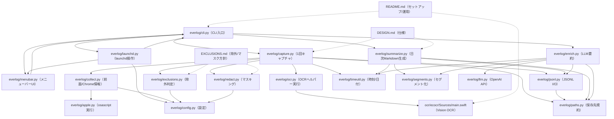

<!--
Role: 「どのファイルが何をしているか」を人間向けに俯瞰できるようにする。
How: 各ファイルの役割と、他ファイルとの連携（自然言語）に絞って記載し、関数レベルの詳細は各ソース先頭コメントに寄せる。
Key sections: データフロー、保存先、ファイル別の役割と連携。
Collaboration: 仕様は DESIGN.md、運用ルールは EXCLUSIONS.md、セットアップは README.md と連動する。
-->
# リポジトリ構成 / 実装マップ（everlog v0.2）

## 1. ざっくり全体像
### データフロー
1. `launchd`（短命）または手動で `everlog capture` を起動
2. 前面アプリ/ウィンドウタイトル/（Chromeなら）URLを取得
3. `screencapture` でスクショ → `ecocr`（Vision）でOCR
4. 除外判定（アプリ/ドメイン/キーワード）→ マスキング → JSONL追記
5. 1日1回（または手動で）:
   - `everlog enrich --date today` でLLM要約（任意）
   - `everlog summarize --date today` で Markdown 生成

### 実行体（3本立て）
- **収集（短命）**: `launchd` の StartInterval で定期起動（`com.everlog.capture`。互換: `com.everytimecapture.capture`）
- **日次処理（短命）**: `launchd` の StartCalendarInterval で毎日23:55に起動（`com.everlog.daily`。互換: `com.everytimecapture.daily`）
- **UI（常駐）**: `rumps` メニューバー常駐（手動起動 or `launchd` KeepAliveで自動起動）

## 1.1 図（Mermaid）

## 2. 保存先（ローカル）
- `EVERYTIME-LOG/logs/YYYY-MM-DD.jsonl`（イベントログ）
- `EVERYTIME-LOG/out/YYYY-MM-DD.md`（日次Markdown）
- `EVERYTIME-LOG/out/YYYY-MM-DD.llm.json`（LLM要約結果）
- `EVERYTIME-LOG/tmp/`（一時スクショ。デフォルトで削除）
- `EVERYTIME-LOG/config.json`（設定）
- `EVERYTIME-LOG/bin/ecocr`（Vision OCRヘルパー。Swiftでビルドして配置）
- `~/.everlog/*.log`（launchdの標準出力/エラー出力）

## 3. ルート直下のファイル
- `DESIGN.md`
  - 仕様（要件・データスキーマ・実行形態・Notion方針など）
- `EXCLUSIONS.md`
  - 除外/マスキングの方針（運用ルール）
- `ARCHITECTURE.md`
  - このファイル。実装とファイルの対応関係
- `README.md`
  - セットアップ手順・コマンド例・OCRヘルパーのビルド例
- `pyproject.toml`
  - Pythonパッケージ定義（`everlog` CLIのエントリポイント。互換: `everytimecapture`）
- `requirements.txt`
  - メニューバーUI用依存（`rumps`）
- `.gitignore`
  - venv/ビルド成果物などを除外

## 4. Pythonパッケージ `everlog/`
（互換性のため、旧パッケージ名 `everytimecapture/` は薄いshimとして残しています）

### `everlog/cli.py`
- 役割: CLI（`everytimecapture`）の入口
  - ユーザーが叩くサブコマンド（capture/summarize/enrich/launchd/menubar）を受け取り、必要な処理に振り分ける。
  - 「UIからの操作」でも「ターミナルからの操作」でも、最終的には同じCLIを通る構成にして挙動を揃える。
- 連携:
  - 収集は `everlog/capture.py` を呼び出す。
  - LLM要約は `everlog/enrich.py` を呼び出す。
  - 日次のMarkdown生成は `everlog/summarize.py` を呼び出す。
  - 起動/停止の自動化は `everlog/launchd.py` を通じてlaunchdを操作する。
  - メニューバーUIの起動は `everlog/menubar.py` に委譲する。

### `everlog/capture.py`
- 役割: 1回分のキャプチャを実行し、JSONLに追記
  - 前面アプリ/タブ情報を取ってからスクショ→OCR→マスキング→保存までを「1回の処理」にまとめる。
  - 例外が起きても、できるだけ「失敗した」という事実をJSONLに残して後から調査できるようにする。
  - スクショは原則として一時ファイルに置き、処理後に削除する（画像は残さない）。
- 連携:
  - 前面情報の取得を `everlog/collect.py` に委譲する。
  - 除外判定は `everlog/exclusions.py` を使い、必要に応じてOCR前/後で判断材料を増やす。
  - OCRは `everlog/ocr.py` を通じて外部ヘルパー（`ecocr`）を実行する。
  - マスキングは `everlog/redact.py` を通して適用する。
  - 保存は `everlog/jsonl.py` を使い、保存先は `everlog/paths.py` の規約に従う。

### `everlog/collect.py`
- 役割: 前面アプリ/ウィンドウタイトル/Chrome URL取得
  - AppleScript（System Events / Google Chrome）を使って、今ユーザーが見ている「作業コンテキスト」をメタデータとして取得する。
  - Chromeの場合はURL/タイトルも取得し、ドメイン集計に使える形に整形する。
- 連携:
  - AppleScript実行は `everlog/apple.py` に集約しており、ここでは「何を取得したいか」を記述する。
  - 取得した情報は `everlog/capture.py` に渡り、除外判定・ログ保存・サマリ生成の材料になる。

### `everlog/apple.py`
- 役割: AppleScript実行ラッパ
  - `osascript` 実行を一箇所にまとめ、失敗時の扱い（stderr/return code）を統一する。
- 連携:
  - `everlog/collect.py` から呼ばれ、前面情報やChromeのタブ情報取得に使われる。

### `everlog/ocr.py`
- 役割: ローカルOCRの実行（外部バイナリ `ecocr` を呼ぶ）
  - Pythonから直接Visionを叩かずに、Swiftで作ったOCRヘルパーを子プロセスとして呼び出す。
  - 出力はJSONに寄せ、Python側は「文字列」として受け取れるようにすることで差し替えやすくする。
- 連携:
  - `everlog/capture.py` がスクショの一時ファイルを渡してOCR結果を受け取る。
  - 実体は `EVERYTIME-LOG/bin/ecocr`（または環境変数指定）で、Swift側実装は `ocr/ecocr/` にある。

### `everlog/exclusions.py`
- 役割: 除外判定（アプリ/ドメイン/キーワード）
  - 「ログイン/決済/銀行っぽい」など機微情報が混ざりやすい場面で、記録自体をスキップするための判定を行う。
  - OCR全文を保存する方針のため、ここは安全側（除外強め）に倒せるようにしている。
- 連携:
  - 判定の材料（アプリ名・ドメイン・タイトル・OCRの一部）は `everlog/collect.py` / `everlog/ocr.py` 由来。
  - ルールは `everlog/config.py`（`exclude`）に置き、UIから編集できる形にする。
  - 最終的に `everlog/capture.py` が「除外イベント」としてJSONLに残す。

### `everlog/redact.py`
- 役割: OCRテキストのマスキング（メール/電話/カード/認証周辺）
  - OCR全文の中に混ざる可能性が高いPII/認証情報を、保存前にパターンで置換する。
  - クレジットカードは誤検知を減らすため、候補検出に加えて簡易チェック（Luhn）も使う。
- 連携:
  - `everlog/capture.py` がOCR結果に適用してからJSONLへ保存する。
  - マスキングのON/OFFは `everlog/config.py` で制御する。

### `everlog/config.py`
- 役割: `EVERYTIME-LOG/config.json` の読み書き・デフォルト提供
  - 「間隔」「除外ルール」「マスキング設定」など、運用で変えたい値をJSONにまとめる。
  - 設定が存在しない場合は安全なデフォルトを生成し、UIからすぐ編集できる状態にする。
- 連携:
  - `everlog/capture.py` が間隔や除外/マスキング設定を参照する。
  - `everlog/launchd.py` が間隔をplistに反映する。
  - `everlog/menubar.py` が設定ファイルを開いたり、値変更を保存したりする。

### `everlog/paths.py`
- 役割: 保存先パスの集約とディレクトリ作成
  - ログ/出力/一時/ヘルパーバイナリの置き場所を一箇所に集約し、「どこに何があるか」を揃える。
  - 初回実行時や不足時にディレクトリを作る責務もここに寄せている。
- 連携:
  - `capture`/`summarize`/`ocr`/`menubar` などが保存先を参照し、同じディレクトリ規約に従う。

### `everlog/jsonl.py`
- 役割: JSONLの追記/読み取り
  - 1イベント1行のログを「壊れにくく追記しやすい」形式で保存し、あとから集計できるようにする。
- 連携:
  - `everlog/capture.py` が追記に使い、`everlog/summarize.py` が読み取りに使う。

### `everlog/timeutil.py`
- 役割: ISOタイムスタンプ生成、`today` の正規化
  - ログに残すタイムスタンプの形式を揃え、日次処理で扱いやすくする。
- 連携:
  - `everlog/capture.py` がイベント時刻を作るために使い、`everlog/summarize.py` が日付引数の解釈で使う。

### `everlog/segments.py`
- 役割: JSONLイベントを「作業セグメント」にまとめ、LLM入力に使える特徴量を抽出
  - 連続するイベントを app/domain/title の近似キーでまとめ、OCRから短いキーワード/スニペットを抽出する。
- 連携:
  - `everlog/summarize.py` と `everlog/enrich.py` が共通利用する。

### `everlog/enrich.py`
- 役割: 1日分のJSONLをLLMで要約して、セグメント単位のラベル/要約を生成
  - JSONLを読み込みセグメント化→OpenAI APIで解析→結果を `out/YYYY-MM-DD.llm.json` に保存する。
- 連携:
  - `everlog/cli.py` から呼ばれる。`everlog/summarize.py` が結果を参照する。
  - LLM呼び出しは `everlog/llm.py` に委譲する。

### `everlog/llm.py`
- 役割: OpenAI APIで作業セグメントを要約/ラベル付けする
  - Responses API (`/v1/responses`) を呼び出し、JSON形式の結果をパースして返す。
  - JSON Schemaを指定して構造化出力を強制する。
- 連携:
  - `everlog/enrich.py` から使用する。
  - `.env` ファイルから `OPENAI_API_KEY` を自動読み込みする機能あり。

### `everlog/summarize.py`
- 役割: 1日分のJSONLからMarkdownを生成（セグメント単位でタイムライン）
  - JSONLを読み取り、推定総時間・TOP3・セグメント単位のタイムラインを作ってMarkdownとして出力する。
  - LLM結果（`out/YYYY-MM-DD.llm.json`）があれば、作業名/要約/カテゴリを反映する。
- 連携:
  - 入力は `everlog/jsonl.py` を通じて読み込み、出力先は `everlog/paths.py` の規約に従う。
  - セグメント化は `everlog/segments.py` を使用する。
  - 生成は `everlog/cli.py` / `everlog/menubar.py` から呼ばれる。

### `everlog/launchd.py`
- 役割: LaunchAgent plist生成と `launchctl` 操作
  - 「定期キャプチャ（短命）」「日次処理（短命）」「メニューバーUI（常駐）」の3種類のLaunchAgentを用意し、ログイン時に自動起動できるようにする。
  - plist生成をコードで行うことで、間隔変更などを「設定保存→再ロード」で確実に反映できる形にする。
- 連携:
  - 定期キャプチャは `everlog/cli.py` 経由で「1回キャプチャ」を呼ぶ形になる。
  - 日次処理は毎日23:55に `enrich` → `summarize` を順次実行する。
  - StartInterval（間隔）は `everlog/config.py` の値を読み取って反映する。
  - UI自動起動は `everlog/menubar.py` を起動するplistを生成する。
  - 画面収録権限の問題を回避するため、`capture_app_path` が設定されていれば `.app` 経由で実行する。

### `everlog/menubar.py`
- 役割: メニューバーUI（`rumps`）
  - メニューから Start/Stop・間隔変更・除外設定・手動キャプチャ・日次生成を行えるようにし、運用を「触れるUI」に寄せる。
  - ステータス表示として、当日のキャプチャ回数と直近キャプチャ時刻をログから読み取って表示する。
  - UIは「ロジックを持ちすぎない」方針で、実行はCLIを呼び出す形にしている（挙動の一貫性のため）。
- 連携:
  - 起動/停止などは `everlog/launchd.py` 経由でlaunchdを操作する（UIはCLIを呼ぶ）。
  - 間隔や除外設定は `everlog/config.py` に保存し、必要に応じて定期キャプチャの再ロードを行う。
  - 今日のキャプチャ回数/前回時刻は `everlog/jsonl.py` で当日ログを読み取って算出する。

## 5. OCRヘルパー（Swift）
### `ocr/ecocr/Package.swift`
- 役割: SwiftPM定義（macOS向け実行バイナリ `ecocr`）
  - Vision Frameworkを使う実行ファイルをSwiftPMでビルドできるようにし、Python側から呼び出せる形にする。
- 連携:
  - ビルド成果物（`ecocr`）は `EVERYTIME-LOG/bin/ecocr` に配置し、`everlog/ocr.py` から実行される。

### `ocr/ecocr/Sources/main.swift`
- 役割: Vision FrameworkでOCRして `{"text":"..."}` をstdoutに出す
  - 画像ファイルを読み込み、Visionのテキスト認識を実行して、行単位の文字列として結合する。
  - 出力はJSON 1行にして、親プロセス（Python）がそのままパースできる形にする。
- 連携:
  - `everlog/capture.py` → `everlog/ocr.py` 経由で起動され、スクショの一時ファイルを入力として受け取る。

## 6. macOSアプリ化（`macos_app/`）
macOSの「画面収録」設定で `python` を追加できない問題を回避するための `.app` ラッパー。

### `macos_app/setup.py`
- 役割: `py2app` でのビルド設定
  - Bundle ID: `com.everlog.app`
  - 生成物: `macos_app/dist/everlog.app`

### `macos_app/Everlog.py`
- 役割: py2app版のエントリポイント
  - CLIを呼び出すシンプルなラッパー

### `macos_app/build_capture_app.sh`
- 役割: AppleScript（JXA）製の最小 `.app` を生成
  - `osacompile` で `macos_app/dist/everlog-capture.app` を生成
  - ネットワーク制限がある環境向け（`pip install py2app` が不要）
- 連携:
  - 生成した `.app` に画面収録権限を付与し、`capture_app_path` で指定すると launchd から使用される
